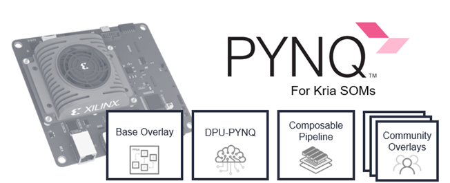
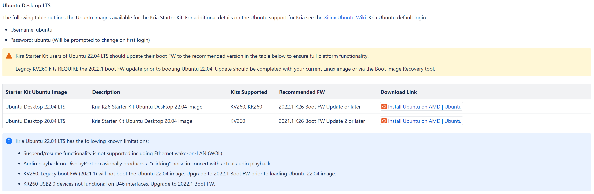

# pynq_kv260


## Ubuntu Desktop LTS


[Ubuntu Desktop LTS](https://xilinx-wiki.atlassian.net/wiki/spaces/A/pages/1641152513/Kria+SOMs+Starter+Kits#Ubuntu-Desktop-LTS)

The Ubuntu Desktop 22.04 is the primary OS targeted by the KV260 pre-built applications and out of box workflows. But legacy boot FW (2021.1) will not boot the Ubuntu 22.04 image. Upgrade to 2022.1 Boot FW prior to loading Ubuntu 22.04 image.

["xmutil bootfw_update” on-target utility](https://xilinx-wiki.atlassian.net/wiki/spaces/A/pages/1641152513#Boot-FW-Update-Process)

[Xilinx download - 2022.2_update1_BOOT.BIN](https://www.xilinx.com/member/forms/download/design-license-xef.html?filename=BOOT-k26-starter-kit-20230516185703.bin)   

### Image Boot Utility

>
>
>[Rufus](https://github.com/pbatard/rufus)
>When you need helps format and create bootable USB flash drives.

## System Update

You can view the GUI (Ubuntu Desktop) on a monitor connected through the HDMI port on the FPGA board. However, for better convenience and control, I recommend using a Serial Terminal or connecting to the system via SSH for accessing and interacting with the environment. These methods tend to be more reliable, especially for remote management or troubleshooting purposes.

### Terminal
>
>
>[MobaXterm](https://mobaxterm.mobatek.net/)
>Enhanced terminal for Windows with X11 server, tabbed SSH client, network tools and much more(UART)

>* Serial(UART) Communication
>
>Speed (Baudrate): 115,200
>
>Data Bits: 8
> 
>Stop Bits: 1
> 
>Parity: None
> 
>Flow Control: None

* Username: **ubuntu**
* Password: **ubuntu**


  

>* SSH
>

```
public class BootSpringBootApplication {
  public static void main(String[] args) {
    System.out.println("Hello, Honeymon");
  }
}
```
