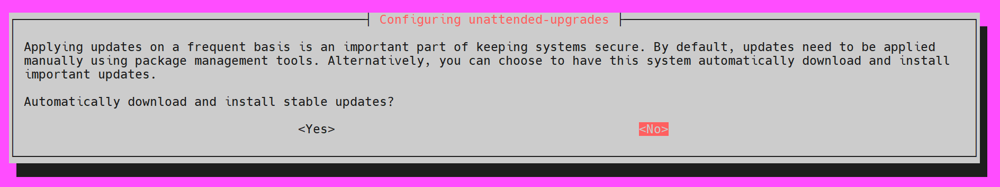

# pynq_kv260

<br>

## Ubuntu Desktop LTS


[Ubuntu Desktop LTS](https://xilinx-wiki.atlassian.net/wiki/spaces/A/pages/1641152513/Kria+SOMs+Starter+Kits#Ubuntu-Desktop-LTS)

The Ubuntu Desktop 22.04 is the primary OS targeted by the KV260 pre-built applications and out of box workflows. But legacy boot FW (2021.1) will not boot the Ubuntu 22.04 image. Upgrade to 2022.1 Boot FW prior to loading Ubuntu 22.04 image.

["xmutil bootfw_update” on-target utility](https://xilinx-wiki.atlassian.net/wiki/spaces/A/pages/1641152513#Boot-FW-Update-Process)

[Xilinx download - 2022.2_update1_BOOT.BIN](https://www.xilinx.com/member/forms/download/design-license-xef.html?filename=BOOT-k26-starter-kit-20230516185703.bin)   
<br>

### Image Boot Utility

>
>
>[Rufus](https://github.com/pbatard/rufus)
>When you need helps format and create bootable USB flash drives.


<br><br>
## System Update

You can view the GUI (Ubuntu Desktop) on a monitor connected through the HDMI port on the FPGA board. However, for better convenience and control, I recommend using a Serial Terminal or connecting to the system via SSH for accessing and interacting with the environment. These methods tend to be more reliable, especially for remote management or troubleshooting purposes.

### Terminal
>
>
>[MobaXterm](https://mobaxterm.mobatek.net/)
>Enhanced terminal for Windows with X11 server, tabbed SSH client, network tools and much more(UART)

>* Serial(UART) Communication
>
>Speed (Baudrate): 115,200
>
>Data Bits: 8
> 
>Stop Bits: 1
> 
>Parity: None
> 
>Flow Control: None

* Username: **ubuntu**
* Password: **ubuntu**

```
sudo apt install net-tools
```

>* SSH
>  
>Use the Ubuntu username and password, and for the Remote host (IP address), find it using the `ifconfig` command in the terminal (either through the GUI or Serial Terminal) on the KV260. Make sure to set the port to 22.
>
>*To transfer files in `/root/jupyter_notebook/` using MobaXterm, you will need root SSH access permissions*
>
>```
>sudo passwd root # make root password
>sudo vim /etc/ssh/sshd_config
>```
> * PermitRootLogin yes
>```
>service sshd reload
>```

### ** keep the local version currently installed **

```
sudo dpkg-reconfigure -plow unattended-upgrades
```
--`NO`



```
sudo apt-get install git
sudo apt update
sudo apt -f install
sudo apt full-upgrade
sudo snap install xlnx-config --classic --channel=2.x
sudo xlnx-config.sysinit
```

### ** !Do not upgrade the Ubuntu version! **
```
sudo nano /etc/update-manager/release-upgrades
```
>```
>Prompt=never
>```


<br><br>
## Install PYNQ

```
git clone https://github.com/Xilinx/Kria-PYNQ.git
cd Kria-PYNQ
sudo bash install.sh -b KV260
sudo apt autoremove
sudo reboot
```
```
sudo /usr/local/share/pynq-venv/bin/python3 -m pip install --upgrade pip
sudo /usr/local/share/pynq-venv/bin/python3 -m pip install torch torchvision pillow opencv-python
sudo /usr/local/share/pynq-venv/bin/python3 -m pip install --upgrade jupyter
```

<br>

## Test PYNQ
```
sudo ./selftest.sh #/path-Kria-PYNQ/ sudo ./home/ubuntu/Kria-PYNQ/selftest.sh
```

<br>

## Open Jupyter notebooks

Open Chrome on a PC that is on the **Local Area Network** as the Kria and type this in the address bar:`kria:9090/lab`

* Password: **xilinx**

<br>

## OpenCV Face Detection Webcam.ipynb
`/kv260/video/OpenCV Face Detection Webcam.ipynb`

<br>

## OpenCV Face Detection Webcam.ipynb
`/pynq-dpu/dpu_mnist_classifier.ipynb`
> ----> 1 raw_data = mnist.test_images()
> 
> HTTPError: HTTP Error 403: Forbidden

There are some issues downloading the MNIST dataset due to server problems. Please use the ipynb project that have uploaded.

<br>

## PYNQ-DPU

| PYNQ Release Version | PYNQ-DPU Release Version | Vitis AI Release Version | 
|----------------------|--------------------------|--------------------------|
| v3.0                 | v2.5                     | v2.5                     |

<br>

### Install Vitis-AI 2.5
The first step is to clone and follow the install steps for `Vitis AI 2.5` on the host machine.
```
git clone https://github.com/Xilinx/Vitis-AI --branch 2.5
cd Vitis-AI
```
[Vitis-AI 2.5 github](https://github.com/Xilinx/Vitis-AI/tree/2.5)

<br>

### Build the Docker Container from Xilinx Recipes
This script enables developers to build a container for a specific framework. This single unified script supports CPU-only hosts, GPU-capable hosts, and AMD ROCm-capable hosts.
```
cd <Vitis-AI install path>/Vitis-AI/docker
./docker_build_gpu.sh

### Setup Container ###
docker image ls
docker run --gpus all -p 8888:8888 -v <Host path>:workspace -it <REPOSITORY:TAG> /bin/bash

### Run Container ###
docker image ls
docker start <CONTAINER ID> && docker exec -it <CONTAINER ID> /bin/bash
```

<br>

### Quantizing the Model PyTorch Version (from pytorch_nndct)
```
conda activate vitis-ai-pytorch
### pip install webcolors==1.10
jupyter notebook --no-browser --port=8888 --ip=0.0.0.0
```
>```
>inspector.inspect(model, (dummy_input,), device=device, output_dir="inspect", image_format="png")
>quantizer = torch_quantizer(quant_mode, model, dummy_input)
>```

<br>

** Verify `.xmodel` with [netron.app](https://netron.app/). **

<br>

## Compile the Model PyTorch Version (vai_c_xir)
For PyTorch, the quantizer NNDCT outputs the quantized model in the XIR format directly. Use vai_c_xir to compile it.

For pre-built DPU xclbins in Vitis AI releases, you can find the corresponding arch.json file in Vitis AI docker (`/opt/vitis_ai/compiler/arch`). 
```
vai_c_xir -x /PATH/TO/quantized.xmodel -a /PATH/TO/arch.json -o /OUTPUTPATH -n netname
```


<br><br><br>
* * *
## Reference

[Getting Started with Kria KV260 Vision AI Starter Kit (Ubuntu 22.04)](https://www.amd.com/en/products/system-on-modules/kria/k26/kv260-vision-starter-kit/getting-started-ubuntu/getting-started.html)

[Xilinx Wiki/Boards and Kits/Kria SOMs & Starter Kits](https://xilinx-wiki.atlassian.net/wiki/x/AQDSYQ)

[Kria-PYNQ github](https://github.com/Xilinx/Kria-PYNQ)

[PYNQ github](https://github.com/Xilinx/PYNQ/)

[PYNQ: Python productivity for Adaptive Computing platforms](https://pynq.readthedocs.io/en/latest/index.html)

[DPU-PYNQ github](https://github.com/Xilinx/DPU-PYNQ)

* * *
* * *
